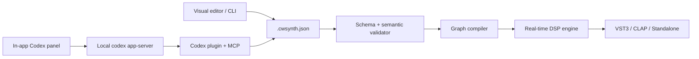

# CanWeSynth

**An open, AI-native wavetable instrument platform for Linux, Windows, and the
people who want to invent the next synthesizer.**

CanWeSynth is building a great open-source wavetable synth and a safe,
versioned way to create instruments with either a visual editor or Codex.
Humans and agents work on the same declarative `.cwsynth.json` document. The
audio engine compiles that document into a real-time-safe graph; generated code
never runs directly in the audio callback.

> [!IMPORTANT]
> CanWeSynth is pre-alpha. The repository already contains a playable DSP core,
> a VST3/CLAP/JACK wrapper, an instrument schema and CLI, a Codex app-server
> client, and a Codex plugin/MCP server. It is not yet a Serum replacement.

## Why this project

Great open synths already exist. [Surge XT](https://github.com/surge-synthesizer/surge)
has an exceptional maintained DSP ecosystem, [Vital](https://github.com/mtytel/vital)
demonstrated an approachable visual modulation workflow, and
[Vaporizer2](https://github.com/VASTDynamics/Vaporizer2) has a powerful
wavetable editor. CanWeSynth aims to add a new layer:

- a stable, reviewable instrument format;
- equal editing power for musicians and coding agents;
- one engine targeting native Linux, Windows VST3 for FL Studio under
  Wine/Proton, CLAP, and standalone operation;
- a welcoming project where DSP, UI, presets, documentation, accessibility,
  packaging, and agent-tool contributors all have meaningful work.

We use ideas and compatible libraries with attribution. We do not redistribute
other projects' names, factory presets, branding, or online services.

## What works today

- `synth-core`: band-limited basic oscillators, ADSR, low-pass filtering,
  polyphonic voice allocation, and deterministic rendering tests.
- `CanWeSynth` plugin: DPF-based VST3, CLAP, and JACK/standalone targets.
- `@canwesynth/instrument-schema`: versioned JSON schema plus semantic
  validation, revisions, and transactional edits.
- `canwesynth` CLI: create, inspect, validate, and modify instruments.
- `@canwesynth/codex-bridge`: JSON-RPC client for local `codex app-server`,
  including ChatGPT OAuth handoff without handling tokens in the app.
- Codex plugin: an MCP server exposing the same instrument operations used by
  the CLI, plus a focused instrument-design skill.

## Architecture



The app-server integration is intentionally an adapter. Saved instruments and
the audio engine do not depend on Codex, an account, or network access.

## Quick start

### TypeScript tools

Requirements: [Bun](https://bun.sh/) 1.3 or newer.

```bash
make install
make test
bun run canwesynth create instruments/my-first-synth.cwsynth.json \
  --name "My First Synth"
bun run canwesynth validate instruments/my-first-synth.cwsynth.json
```

### Audio engine and plugin

Requirements on Ubuntu/Debian:

```bash
sudo apt update
sudo apt install build-essential cmake ninja-build pkg-config \
  libgl1-mesa-dev libx11-dev libxext-dev libxrandr-dev libxcursor-dev \
  libasound2-dev libjack-jackd2-dev
```

Then:

```bash
git submodule update --init --recursive
make configure
make build
make test
```

Build products are placed under `build/bin/`. The Linux VST3 is useful in
native Linux hosts. FL Studio running through Wine/Proton requires the Windows
x64 VST3 produced by the Windows CI build.

### Codex extension

During repository development:

```bash
make plugin
codex plugin marketplace add .
codex plugin add canwesynth@canwesynth
```

The extension gives Codex constrained tools for creating, reading, validating,
and transactionally editing instruments. See
[docs/codex-integration.md](docs/codex-integration.md).

## A contribution for every kind of maker

- **Musicians:** test sounds, design factory presets, improve naming, and report
  workflow friction.
- **DSP developers:** oscillators, filters, modulation, oversampling, SIMD, and
  profiling.
- **UI developers/designers:** the graph editor, modulation gestures,
  accessibility, visualization, and keyboard workflows.
- **Linux/audio developers:** PipeWire/JACK, Wine/Proton installation,
  packaging, and DAW compatibility.
- **Agent-tool developers:** MCP tools, app-server adapters, evaluations, and
  safe graph transformations.
- **Writers/educators:** tutorials, sound-design recipes, translations, and
  contributor onboarding.

Start with [CONTRIBUTING.md](CONTRIBUTING.md) and the
[roadmap](ROADMAP.md). Small, well-tested changes are preferred.

## Principles

1. Sound quality is measured.
2. The audio thread never allocates, locks, performs I/O, or runs generated
   code.
3. Instrument documents remain useful without AI.
4. Agent changes are inspectable, reversible, and revision-checked.
5. Local-first is the default; network features require explicit user action.
6. Accessibility and Linux support are product requirements.
7. Upstream projects receive attribution and improvements where practical.

## License

CanWeSynth is licensed under
[GNU GPL v3.0 or later](LICENSE). Dependencies retain their own licenses; see
[THIRD_PARTY.md](THIRD_PARTY.md).
